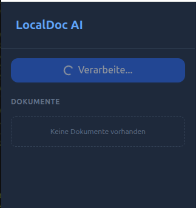
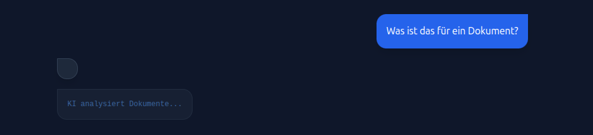
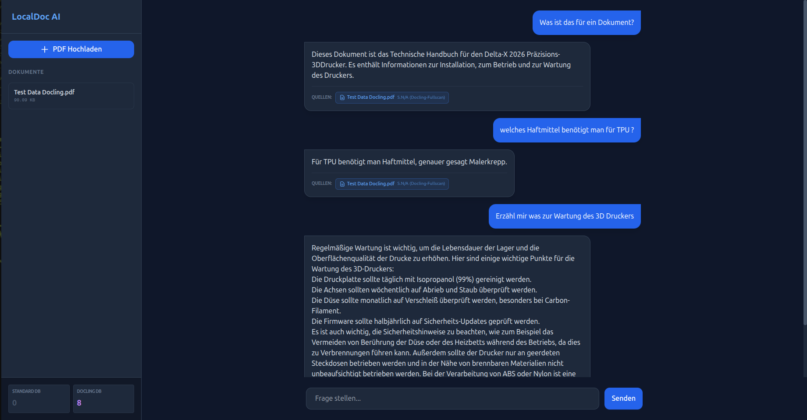
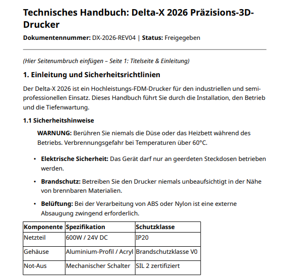
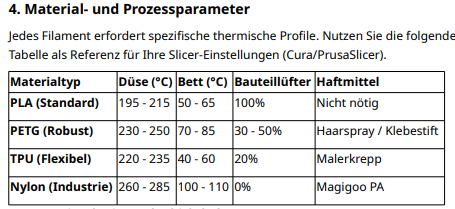

#  LocalDoc AI

Willkommen bei **LocalDoc AI**! Eine hochmoderne, komplett lokal laufende RAG-Lösung (Retrieval-Augmented Generation), mit der du PDF-Dokumente hochladen, analysieren und intelligent über eine Chat-Schnittstelle befragen kannst. Keine Cloud, keine externen APIs – deine Daten bleiben zu 100% bei dir.

---

##  Projektziel

Der Hauptzweck von LocalDoc AI ist es, eine sichere, effiziente und performante Arbeitsumgebung für die Verarbeitung von vertraulichen Dokumenten zu schaffen. 
* **100% Datenschutz:** Die KI läuft lokal via Ollama, Dokumente werden lokal auf deiner Maschine verarbeitet und indexiert.
* **Intelligente Fallbacks:** Ein dynamisches Ingest-System entscheidet automatisch, ob eine einfache Textextraktion (via PyMuPDF) reicht oder ob das mächtige **Docling**-Modul für die Verarbeitung komplexer Tabellen in strukturiertes Markdown benötigt wird.
* **Open Source & Erweiterbar:** Eine saubere, modulare Architektur, die sich leicht an eigene Bedürfnisse anpassen lässt.

---

##  Screenshots & Showcase

Um die Fähigkeiten von LocalDoc AI – insbesondere das Auslesen von Tabellen und das Verständnis technischer Kennzahlen – zu demonstrieren, wurde als Testdokument **das Technische Handbuch eines fiktiven 3D-Druckers (4 Seiten)** verwendet.

### 1. Dokumenten-Upload & Verarbeitung
Beim Upload der PDF erkennt die intelligente Pipeline dank der enthaltenen Tabellen sofort, dass das Dokument komplex ist, und nutzt automatisch **Docling** für die detaillierte Struktur-Extraktion.



### 2. Fragestellung & Nachdenkzeit
Eingabe der Fragestellung im Chat. Während die UI "KI analysiert Dokumente..." anzeigt, sucht das System im Hintergrund (via RAG-Retrieval & Reranking) rasend schnell nach den relevantesten Abschnitten in der Vektordatenbank.



### 3. Chat-Interface & Volle Anwendung
Die KI beantwortet komplexe, technische Fragen (z.B. nach bestimmten Haftmitteln für TPU oder Wartungsintervallen) punktgenau basierend auf den verarbeiteten Tabellen. Unter jeder Antwort wird transparent die referenzierte Quelle angezeigt.



### 4. Auszüge aus dem Test-Dokument
Hier sind Beispiele aus dem verwendeten 3D-Drucker Handbuch. Die komplexe Formatierung (Tabellen mit Prozessparametern und Wartungsplänen) wird von LocalDoc AI mühelos gelesen und verstanden.

<div style="display: flex; gap: 10px; flex-wrap: wrap;">
  
  
</div>

---

##  Architektur

Der Datenfluss im System sieht grob folgendermaßen aus:

1. **Upload:** Der Nutzer lädt über das React-Frontend ein PDF hoch.
2. **Entscheidung & Verarbeitung:** Das FastAPI-Backend analysiert das Dokument. Besteht es aus komplexen Tabellenstrukturen, übernimmt `Docling` das Parsing (Formatierung als Markdown). Andernfalls läuft eine leichtgewichtige Standard-Verarbeitung (`PyMuPDF`).
3. **Embedding:** Die extrahierten Textblöcke werden über lokale HuggingFace Sentence-Transformers (z.B. `multilingual-e5-small`) in Vektoren umgewandelt.
4. **Speicherung:** Diese Vektoren werden in persistente SQLite-Tensordatenbanken via `ChromaDB` abgelegt.
5. **Retrieval & Generation (RAG):** Stellt der Nutzer eine Frage, sucht der RAG-Service nach den relevantesten Textstücken (mit Cross-Encoder Reranking), fügt sie als Kontext in einen Prompt ein und streamt die Antwort über `Ollama` an das Frontend zurück.

---

##  Tech Stack

**Frontend:**
* [React 19](https://react.dev/) + [Vite](https://vitejs.dev/)
* [Tailwind CSS](https://tailwindcss.com/) (für rasantes, responsives Styling)
* `react-markdown` für saubere KI-Ausgaben

**Backend:**
* [Python 3.10](https://www.python.org/) + [FastAPI](https://fastapi.tiangolo.com/) (performante asynchrone API)
* [ChromaDB](https://www.trychroma.com/) (Vektordatenbank)
* [Docling](https://github.com/DS4SD/docling) (fortschrittliche Dokumentenstrukturanalyse)
* [Sentence-Transformers](https://sbert.net/) (Bi-Encoder und Cross-Encoder für Embeddings/Reranking)

**LLM & DevOps:**
* [Ollama](https://ollama.com/) (Inferenz-Engine für lokale Modelle, standardmäßig `llama3.1`)
* **Docker & Docker Compose** (Containerisierung, isolierte Netzwerke, Host-Routing)

---

##  Setup Anleitung

### 1. Voraussetzungen
* **[Git](https://git-scm.com/)**
* **[Docker](https://www.docker.com/)** und **Docker Compose**
* **[Ollama](https://ollama.com/)** (auf deinem Host-Rechner installiert)

### 2. Repository klonen
```bash
git clone https://github.com/Chatchai-lab/localdoc-ai.git
cd localdoc-ai
```

### 3. Ollama & KI-Modell vorbereiten
Das Backend sendet die Prompts an deine lokale Ollama-Instanz. Lade zunächst das Standardmodell herunter:
```bash
# Lade das LLaMA 3.1 Modell
ollama pull llama3.1

# Lasse Ollama im Hintergrund laufen (meist passiert dies automatisch nach der Installation)
ollama serve
```

### 4. Mit Docker starten
Starte das gesamte System (Frontend, FastAPI-Backend, ChromaDB) bequem über Docker:

```bash
docker-compose up -d --build
```
*(Der Zusatz `-d` startet die Container im Hintergrund. Der erste Start dauert etwas, da Vektor-Modelle geladen und grafische Systempakete für Docling installiert werden).*

 **Fertig!** Öffne nun deinen Browser unter: **[http://localhost:5173](http://localhost:5173)**

---

##  Hinweis zu "Docling" (Optionale Erweiterung)

Das Projekt nutzt **Docling** von IBM für eine herausragende Textextraktion bei Layouts mit komplexen Tabellen. Da Docling bestimmte Systembibliotheken (wie `libgl1`) benötigt, ist Docker die bevorzugte Startmethode, da hier alles vorkonfiguriert ist.

* **Leichtgewichtiger Build:** Falls du Tabellen-Parsing nicht benötigst und ein kleineres Image möchtest, öffne die `Dockerfile` im Ordner `/backend` und kommentiere die Installation der entsprechenden `requirements-pdf.txt` aus. Das System erkennt das Fehlen automatisch und verwendet die Standard-PyMuPDF-Pipeline!

##  Server stoppen
Um alle Dienste herunterzufahren, nutze:
```bash
docker-compose down
```
Keine Sorge: Deine verarbeiteten Vektoren und heruntergeladenen Modelle im Ordner `/data` bleiben persistent!

---

##  Mögliche Verbesserungen


* [ ] **Multimodalität:** Unterstützung für weitere Dateiformate wie `.docx`, `.xlsx`, oder `.csv`.
* [ ] **Memory Management:** Einen echten "Conversation Buffer" einbauen, damit die KI sich an vorherige Fragen in einem Chat-Verlauf erinnert.
* [ ] **Modell-Wechsler im Frontend:** Eine Dropdown-Auswahl in der UI, die es erlaubt, zwischen verschiedenen via Ollama verfügbaren Modellen (z.B. *mistral*, *phi3*) zu wechseln.
* [ ] **Live-Quellen-Preview:** Beim Klick auf eine referenzierte Seite in der KI-Antwort öffnet sich parallel das PDF-Dokument an genau dieser Stelle.
* [ ] **Cloud-Sync (Optional):** Optionales Backup der Vektordatenbank auf AWS/GCP, falls mehrere Rechner denselben Stand nutzen sollen.
